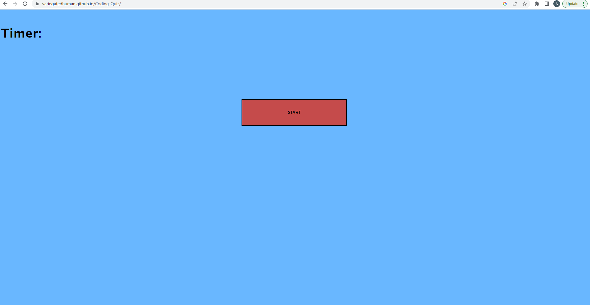

# Adam's Javascript Study Guide Quiz

Creation of a Study Guide multiple choice quiz that tests a users knowledge of Javascript. Quiz is timed and scores are recorded for future reference. 

## Project Goal

Project fulfills the following criteria:

GIVEN I am taking a code quiz

WHEN I click the start button

THEN a timer starts and I am presented with a question

WHEN I answer a question

THEN I am presented with another question

WHEN I answer a question incorrectly

THEN time is subtracted from the clock

WHEN all questions are answered or the timer reaches 0

THEN the game is over

WHEN the game is over

THEN I can save my initials and score

## Goal Fulfillment

Study Guide Quiz when a user clicks the start button

Timer begins immediately after clicking start button

After each response, user is presented with a new question

Upon making an incorrect response, user is deducted 10 seconds

Quiz ends when all questions are answered or timer reaches 0

Following the quiz the user is able to enter their initials to be saved to a High Score Leader Board

## Screenshot of deployed site

## Link to deployed site
https://variegatedhuman.github.io/Adam-s-Javascript-Study-Guide-Quiz/

## Authors and acknowledgment
Adam Michell with great help from my tutors Joem Casusi and Matthew Calimbas

## License
MIT License

## Project status
Complete
